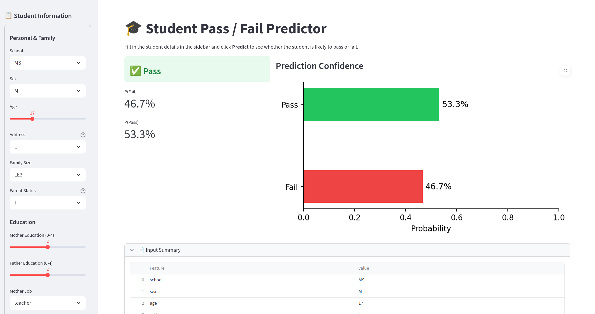

# Student Performance Prediction and Early Intervention
# Overview

This project aims to predict whether a student will pass or fail using machine learning techniques. By analyzing factors such as demographics, attendance, study time, and prior academic performance, the system helps identify students who may be at risk of failing. The goal is to enable early intervention so that educators and counselors can take timely action to improve student outcomes.


## 👥 Team Members & Course Details
*   **Team Members:** Anamika Ponnu, Thanha Noorudheen, Jeeva B S
*   **Course:** Predictive Analytics
*   **Instructor:** Dr. Aswin VS
*   **Institution:** Digital University Kerala

# Objectives

The primary objective of this project is to build a reliable model that can classify student performance into pass or fail categories. In addition to prediction, the project focuses on comparing different machine learning models and identifying students who require additional academic support. A key aspect of this work is ensuring that the predictions are interpretable so that educators can understand the reasoning behind them and make informed decisions

# Dataset

The project uses the UCI Student Performance dataset, which contains detailed information about students’ academic and personal backgrounds. The dataset includes features such as age, gender, study time, attendance records, previous grades, and various family and social factors. These attributes collectively help in understanding patterns that influence student performance.

---

## Project Overview

1. **EDA** — explored grade distributions, absences, study time
2. **Feature engineering** — created binary target from G3, dropped G3 to avoid leakage
3. **Preprocessing** — StandardScaler for numerical, OneHotEncoder for categorical
4. **Training** — compared Logistic Regression, Decision Tree, Gradient Boosting
5. **Evaluation** — accuracy, precision, recall, F1, confusion matrix
6. **Explainability** — LIME to explain individual predictions
7. **Deployment** — Streamlit app with sidebar form and live prediction

**Best model:** Gradient Boosting (~90% accuracy)

---

## Results

| Model | Accuracy | F1 Score |
|---|---|---|
| Logistic Regression | ~87% | ~90% |
| Decision Tree | ~85% | ~89% |
| **Gradient Boosting** | **~90%** | **~92%** |

---

## Streamlit


---

## Run Locally

```bash
# 1. Clone the repo
git clone https://github.com/your-username/student-performance-predictor.git
cd student-performance-predictor

# 2. Create virtual environment
python3 -m venv venv
source venv/bin/activate

# 3. Install dependencies
pip install -r requirements.txt

# 4. Run the app
streamlit run app.py
```

Make sure `models/best_model.pkl` and `models/label_encoder.pkl` exist. If not, run all cells in `student.ipynb` first.

---

## Live App

🔗 [Add your Streamlit Cloud link here](https://streamlit.io)